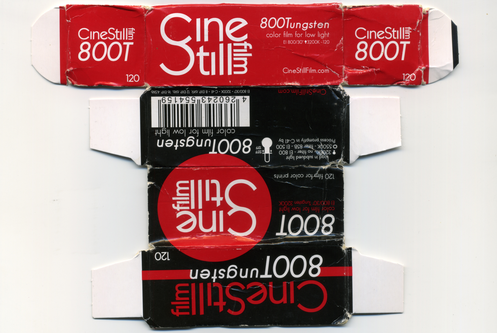
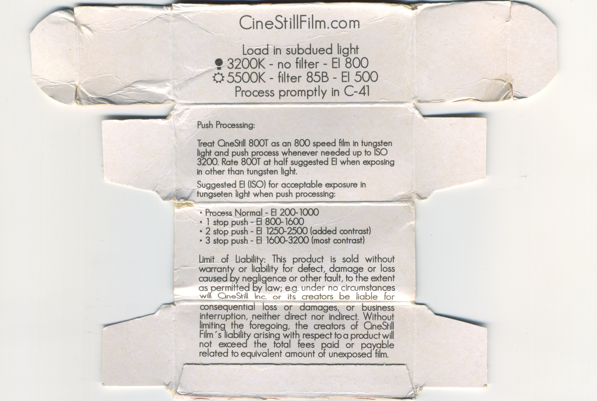
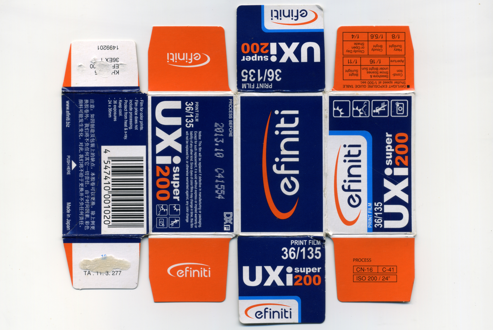
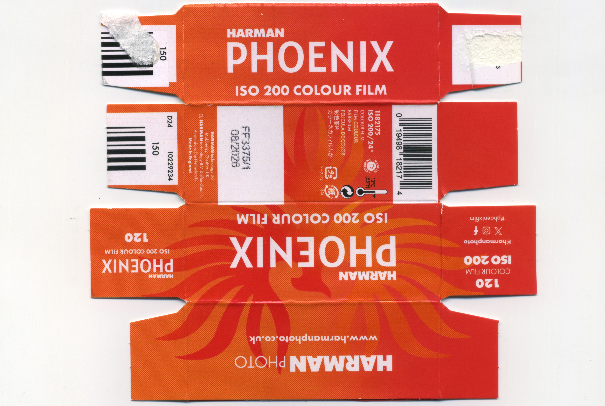
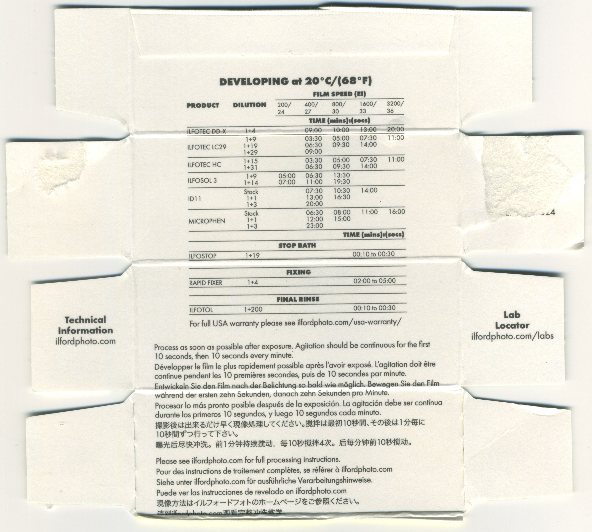
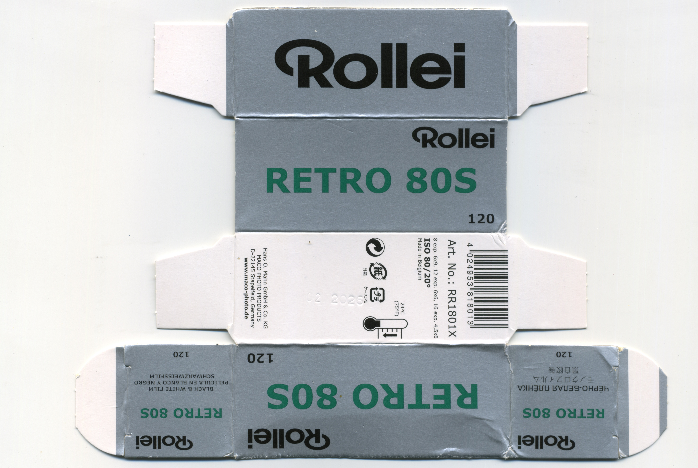
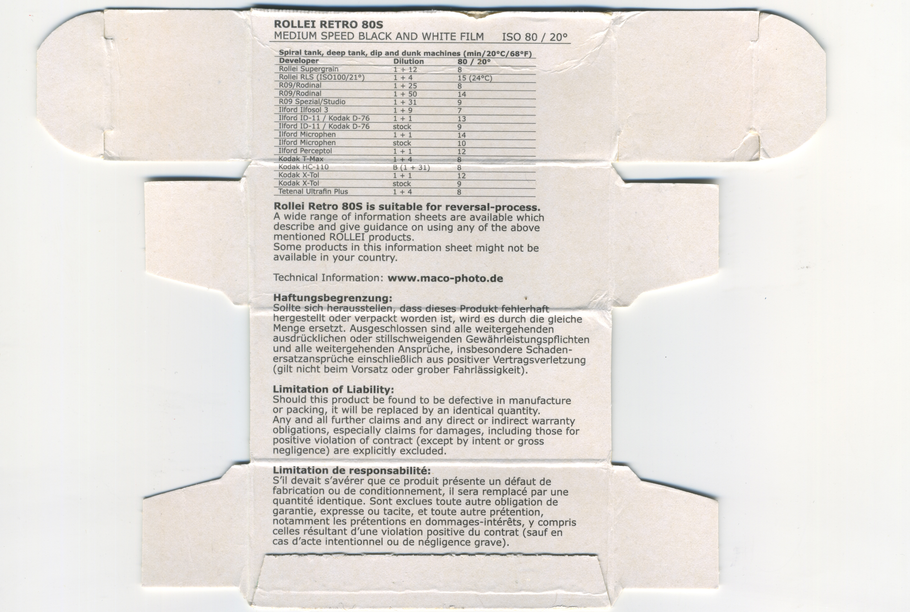

# Film Packaging Archive (Sorted by BRAND)

[Project Home Page](../README.md)

-----

Found this useful? Please [credit the project page](https://github.com/dekuNukem/Film-Packaging)!

Want to contribute? [Check out the guidelines!](../contribution_guide.md)

Click for full size.

```
Last Updated: 

# of items: 84
```

-----


- [AGFA APX (ref: 12c7)](#agfa-apx-ref-12c7)
- [AGFA ULTRA 50 (ref: 4faa)](#agfa-ultra-50-ref-4faa)
- [AGFA Vista (ref: d3af)](#agfa-vista-ref-d3af)
- [Alien Film 5207/250D (ref: 8820)](#alien-film-5207250d-ref-8820)
- [CineStill 800T (ref: c86a)](#cinestill-800t-ref-c86a)
- [Efiniti UXi super 200 (ref: 471a)](#efiniti-uxi-super-200-ref-471a)
- [Efke IR 820 (ref: 43c9)](#efke-ir-820-ref-43c9)
- [Fujifilm FUJICOLOR SUPER HR (ref: aaa0)](#fujifilm-fujicolor-super-hr-ref-aaa0)
- [Fujifilm FUJICOLOR SUPERIA (ref: 0683)](#fujifilm-fujicolor-superia-ref-0683)
- [Fujifilm Fujichrome Professional 100D (ref: 439d)](#fujifilm-fujichrome-professional-100d-ref-439d)
- [Fujifilm Fujicolor 100 (ref: 013b)](#fujifilm-fujicolor-100-ref-013b)
- [Fujifilm Fujicolor NPL 160 (ref: d10b)](#fujifilm-fujicolor-npl-160-ref-d10b)
- [Fujifilm Pro 400H (ref: 66e3)](#fujifilm-pro-400h-ref-66e3)
- [Fujifilm Velvia (ref: 3182)](#fujifilm-velvia-ref-3182)
- [Fujifilm Velvia 100F (ref: f7fb)](#fujifilm-velvia-100f-ref-f7fb)
- [HARMAN PHOENIX (ref: 637f)](#harman-phoenix-ref-637f)
- [Ilford HP5 Plus (ref: 1a5d)](#ilford-hp5-plus-ref-1a5d)
- [Ilford HP5 Plus (ref: efad)](#ilford-hp5-plus-ref-efad)
- [Ilford SFX 200 (ref: 6057)](#ilford-sfx-200-ref-6057)
- [Jessops Diamond Everyday (ref: 67d3)](#jessops-diamond-everyday-ref-67d3)
- [Kentmere PAN (ref: 827e)](#kentmere-pan-ref-827e)
- [Kodak Ektachrome (ref: ce7f)](#kodak-ektachrome-ref-ce7f)
- [Kodak Ektachrome (ref: 07c0)](#kodak-ektachrome-ref-07c0)
- [Kodak Ektachrome (ref: ec3d)](#kodak-ektachrome-ref-ec3d)
- [Kodak Ektacolor Pro Gold (ref: c3f8)](#kodak-ektacolor-pro-gold-ref-c3f8)
- [Kodak Elite Chrome (ref: 523c)](#kodak-elite-chrome-ref-523c)
- [Kodak Gold (ref: 933f)](#kodak-gold-ref-933f)
- [Kodak Kodachrome (ref: 3145)](#kodak-kodachrome-ref-3145)
- [Kodak Kodachrome (ref: 6477)](#kodak-kodachrome-ref-6477)
- [Kodak Kodacolor-X (ref: 5302)](#kodak-kodacolor-x-ref-5302)
- [Kodak Technical Pan 6415 (ref: 03be)](#kodak-technical-pan-6415-ref-03be)
- [Kodak Tri-X (ref: 88c5)](#kodak-tri-x-ref-88c5)
- [Kodak Ultra (ref: 69a1)](#kodak-ultra-ref-69a1)
- [Kodak Verichrome Pan (ref: 0195)](#kodak-verichrome-pan-ref-0195)
- [Konica Infrared 750nm (ref: 2d93)](#konica-infrared-750nm-ref-2d93)
- [Konica Infrared 750nm (ref: e696)](#konica-infrared-750nm-ref-e696)
- [Lloyds Pharmacy Colour Film (ref: 77d9)](#lloyds-pharmacy-colour-film-ref-77d9)
- [Lomography Lomochrome Turquoise (ref: 0d90)](#lomography-lomochrome-turquoise-ref-0d90)
- [Polaroid 665 (ref: e054)](#polaroid-665-ref-e054)
- [Polaroid 669 (ref: 3566)](#polaroid-669-ref-3566)
- [Polaroid GridFilm (ref: 8deb)](#polaroid-gridfilm-ref-8deb)
- [Polaroid PolaBlue (ref: df66)](#polaroid-polablue-ref-df66)
- [Polaroid PolaChrome (ref: 3b60)](#polaroid-polachrome-ref-3b60)
- [Porst Color N21 (ref: 494a)](#porst-color-n21-ref-494a)
- [Rollei Infrared (ref: 4f54)](#rollei-infrared-ref-4f54)
- [Rollei Retro 80S (ref: e6c0)](#rollei-retro-80s-ref-e6c0)


-----


#### AGFA APX (ref: 12c7)
```
ISO     : 100
Format  : 120
Process : BW
Expiry  : 200807
UUID    : a20bbca534454915a6970b6ede2212c7
Scanned By: dekuNukem
```


#### AGFA ULTRA 50 (ref: 4faa)
```
ISO     : 50
Format  : 35mm
Process : C-41
Expiry  : 200110
UUID    : d10e846ba5154f1d940ed7009a904faa
Scanned By: dekuNukem
```


#### AGFA Vista (ref: d3af)
```
ISO     : 200
Format  : 35mm
Process : C-41
Expiry  : 200312
UUID    : f1e50745927f4b7cb16af36fd30dd3af
Scanned By: dekuNukem
```


#### Alien Film 5207/250D (ref: 8820)
```
ISO     : 250
Format  : 120
Process : ECN-2
Expiry  : 202606
UUID    : aedc4b00bd174e0baf7c744ed21d8820
Scanned By: dekuNukem
```


#### CineStill 800T (ref: c86a)
```
ISO     : 800
Format  : 120
Process : C-41
Expiry  : 201803
UUID    : 53253eca96d841f5b98bfb3590fec86a
Scanned By: dekuNukem
```






#### Efiniti UXi super 200 (ref: 471a)
```
ISO     : 200
Format  : 35mm
Process : C-41
Expiry  : 201310
UUID    : cde1122dafbc47088a11d9ee12b6471a
Scanned By: dekuNukem
```



#### Efke IR 820 (ref: 43c9)
```
ISO     : 100
Format  : 120
Process : BW
Expiry  : 201303
UUID    : 716e410a3823476e9befa704361f43c9
Scanned By: dekuNukem
```


#### Fujifilm FUJICOLOR SUPER HR (ref: aaa0)
```
ISO     : 200
Format  : 35mm
Process : C-41
Expiry  : 199002
UUID    : 2d27c9a865aa4de19ad8dc0bcdc8aaa0
Scanned By: dekuNukem
```


[Click me for Instruction Manual / Leaflet #1 for Fujifilm FUJICOLOR SUPER HR (ref: 57f6)](./archive/00007_001.jpg)

[Click me for Instruction Manual / Leaflet #2 for Fujifilm FUJICOLOR SUPER HR (ref: ca7b)](./archive/00007_002.jpg)

#### Fujifilm FUJICOLOR SUPERIA (ref: 0683)
```
ISO     : 400
Format  : 120
Process : C-41
Expiry  : 200205
UUID    : c3d9e51d22e241f69133be30d5a00683
Scanned By: dekuNukem
```


#### Fujifilm Fujichrome Professional 100D (ref: 439d)
```
ISO     : 100
Format  : 120
Process : E-6
Expiry  : 199212
UUID    : 5dcdd19ddf654415b7eac69183e7439d
Scanned By: dekuNukem
```


[Click me for Instruction Manual / Leaflet #1 for Fujifilm Fujichrome Professional 100D (ref: c977)](./archive/00032_001.jpg)

[Click me for Instruction Manual / Leaflet #2 for Fujifilm Fujichrome Professional 100D (ref: 8974)](./archive/00032_002.jpg)

#### Fujifilm Fujicolor 100 (ref: 013b)
```
ISO     : 100
Format  : 35mm
Process : C-41
Expiry  : 201007
UUID    : 27d88b35933b4ede958b5b5b5b42013b
Scanned By: b0baspace
```


#### Fujifilm Fujicolor NPL 160 (ref: d10b)
```
ISO     : 160
Format  : 120
Process : C-41
Expiry  : 199807
UUID    : ce40cc432d9e445b987fdd72fd88d10b
Scanned By: dekuNukem
```


[Click me for Instruction Manual / Leaflet #1 for Fujifilm Fujicolor NPL 160 (ref: 1455)](./archive/00034_001.jpg)

[Click me for Instruction Manual / Leaflet #2 for Fujifilm Fujicolor NPL 160 (ref: 4945)](./archive/00034_002.jpg)

#### Fujifilm Pro 400H (ref: 66e3)
```
ISO     : 400
Format  : 120
Process : C-41
Expiry  : 201809
UUID    : 0d89ecf11f3c46deb52171aa909566e3
Scanned By: dekuNukem
```


#### Fujifilm Velvia (ref: 3182)
```
ISO     : 50
Format  : 35mm
Process : E-6
Expiry  : 200101
UUID    : 9b9ee1c1c0e94d968674987799d33182
Scanned By: @ob.skura
```


[Click me for Instruction Manual / Leaflet #1 for Fujifilm Velvia (ref: 7e76)](./archive/00044_001.jpg)

[Click me for Instruction Manual / Leaflet #2 for Fujifilm Velvia (ref: fc6f)](./archive/00044_002.jpg)

#### Fujifilm Velvia 100F (ref: f7fb)
```
ISO     : 100
Format  : 120
Process : E-6
Expiry  : 200604
UUID    : 0fef128c3b17437eb25d5c4f0520f7fb
Scanned By: dekuNukem
```


#### HARMAN PHOENIX (ref: 637f)
```
ISO     : 200
Format  : 35mm
Process : C-41
Expiry  : 202608
UUID    : 0b11ba38c9a34f58a2f13d696b05637f
Scanned By: dekuNukem
```



#### Ilford HP5 Plus (ref: 1a5d)
```
ISO     : 400
Format  : 120
Process : BW
Expiry  : 202609
UUID    : 36151f6b7cc045c2b43d7f5cbee41a5d
Scanned By: dekuNukem
```




#### Ilford HP5 Plus (ref: efad)
```
ISO     : 400
Format  : 120
Process : BW
Expiry  : 202511
UUID    : ddf9b76e633f43718144af7dcb89efad
Scanned By: dekuNukem
```


#### Ilford SFX 200 (ref: 6057)
```
ISO     : 200
Format  : 120
Process : BW
Expiry  : 201309
UUID    : 7856b5442362453caa67628c93be6057
Scanned By: dekuNukem
```


#### Jessops Diamond Everyday (ref: 67d3)
```
ISO     : 200
Format  : APS
Process : C-41
Expiry  : 200610
UUID    : b53e5c167866448d812a4dc8e85967d3
Scanned By: dekuNukem
```


#### Kentmere PAN (ref: 827e)
```
ISO     : 400
Format  : 35mm
Process : BW
Expiry  : 202906
UUID    : d2cf9753f6fd49a78404c72d848a827e
Scanned By: dekuNukem
```


#### Kodak Ektachrome (ref: ce7f)
```
ISO     : 160
Format  : 120
Process : E-2
Expiry  : 196301
UUID    : ec7cf78858fc48c59e5a0875ec74ce7f
Scanned By: dekuNukem
```


#### Kodak Ektachrome (ref: 07c0)
```
ISO     : 64
Format  : 110
Process : Unknown
Expiry  : 197910
UUID    : 8131d8c6fbf14016be9c17a2586b07c0
Scanned By: dekuNukem
```


#### Kodak Ektachrome (ref: ec3d)
```
ISO     : 160
Format  : 35mm
Process : E-2
Expiry  : 197006
UUID    : 9702189f65de43c59fce151094a7ec3d
Scanned By: @ob.skura
```


[Click me for Instruction Manual / Leaflet #1 for Kodak Ektachrome (ref: 86cd)](./archive/00045_001.jpg)

[Click me for Instruction Manual / Leaflet #2 for Kodak Ektachrome (ref: fc87)](./archive/00045_002.jpg)

#### Kodak Ektacolor Pro Gold (ref: c3f8)
```
ISO     : 160
Format  : 220
Process : C-41
Expiry  : 200007
UUID    : 7456456d09c844c8ab046abd9c17c3f8
Scanned By: dekuNukem
```


[Click me for Instruction Manual / Leaflet #2 for Kodak Ektacolor Pro Gold (ref: ca71)](./archive/00027_002.jpg)

[Click me for Instruction Manual / Leaflet #3 for Kodak Ektacolor Pro Gold (ref: ceb0)](./archive/00027_003.jpg)

#### Kodak Elite Chrome (ref: 523c)
```
ISO     : 100
Format  : 35mm
Process : E-6
Expiry  : 200108
UUID    : e0b3ec957ade47a99d5cd5abe2a4523c
Scanned By: @ob.skura
```


#### Kodak Gold (ref: 933f)
```
ISO     : 200
Format  : 35mm
Process : C-41
Expiry  : 202611
UUID    : e8aefc10fa0d43cebbac73bdcf10933f
Scanned By: dekuNukem
```


#### Kodak Kodachrome (ref: 3145)
```
ISO     : 64
Format  : 110
Process : K-14
Expiry  : 197910
UUID    : 68c945b76fc14ab699b944a3c7b93145
Scanned By: dekuNukem
```


#### Kodak Kodachrome (ref: 6477)
```
ISO     : 25
Format  : 35mm
Process : K-14
Expiry  : 197801
UUID    : 483191da2aa742bba3343cbe9f296477
Scanned By: dekuNukem
```


[Click me for Instruction Manual / Leaflet #1 for Kodak Kodachrome (ref: 83b8)](./archive/00035_001.jpg)

[Click me for Instruction Manual / Leaflet #2 for Kodak Kodachrome (ref: 7f0b)](./archive/00035_002.jpg)


#### Kodak Kodacolor-X (ref: 5302)
```
ISO     : 80
Format  : 126
Process : C-22
Expiry  : 197505
UUID    : 5a3d2ba8ff7649c9b3450d7069445302
Scanned By: dekuNukem
```


#### Kodak Technical Pan 6415 (ref: 03be)
```
ISO     : 25
Format  : 120
Process : BW
Expiry  : 198805
UUID    : 3a03860d64d2400caee97955197703be
Scanned By: dekuNukem
```


[Click me for Instruction Manual / Leaflet #1 for Kodak Technical Pan 6415 (ref: 1bc8)](./archive/00037_001.jpg)

[Click me for Instruction Manual / Leaflet #2 for Kodak Technical Pan 6415 (ref: d075)](./archive/00037_002.jpg)

#### Kodak Tri-X (ref: 88c5)
```
ISO     : 400
Format  : 120
Process : BW
Expiry  : 202512
UUID    : f7f99b9d46a4491c9cbfda4f030f88c5
Scanned By: dekuNukem
```


#### Kodak Ultra (ref: 69a1)
```
ISO     : 400
Format  : 35mm
Process : C-41
Expiry  : 200512
UUID    : 77dfbdf80e3a4950b40c7ea8c1e369a1
Scanned By: @ob.skura
```


#### Kodak Verichrome Pan (ref: 0195)
```
ISO     : 125
Format  : 620
Process : BW
Expiry  : 197103
UUID    : 75c7c232d44949c3b1d766b0d2580195
Scanned By: b0baspace
```


#### Konica Infrared 750nm (ref: 2d93)
```
ISO     : 32
Format  : 120
Process : BW
Expiry  : 200003
UUID    : 63b2857f2df549878446cc1963362d93
Scanned By: dekuNukem
```


#### Konica Infrared 750nm (ref: e696)
```
ISO     : 32
Format  : 120
Process : BW
Expiry  : 199102
UUID    : 79a0275aee8e43e895b5794a8538e696
Scanned By: dekuNukem
```


[Click me for Instruction Manual / Leaflet #1 for Konica Infrared 750nm (ref: f1ad)](./archive/00039_001.jpg)

#### Lloyds Pharmacy Colour Film (ref: 77d9)
```
ISO     : 200
Format  : 35mm
Process : C-41
Expiry  : 200907
UUID    : c58dda071d1741fda90e20b4252277d9
Scanned By: dekuNukem
```


#### Lomography Lomochrome Turquoise (ref: 0d90)
```
ISO     : 100-400
Format  : 120
Process : C-41
Expiry  : 202507
UUID    : 99643a4fc27b4ff298e834fc72970d90
Scanned By: dekuNukem
```


#### Polaroid 665 (ref: e054)
```
ISO     : 80
Format  : Pack Film
Process : Instant
Expiry  : 199608
UUID    : 311d896d68b74b1193afcfa129c5e054
Scanned By: dekuNukem
```


#### Polaroid 669 (ref: 3566)
```
ISO     : 80
Format  : Pack Film
Process : Instant
Expiry  : 200603
UUID    : bb62de3a22c04f699c780aeae7c83566
Scanned By: dekuNukem
```


#### Polaroid GridFilm (ref: 8deb)
```
ISO     : 640
Format  : Integral Film
Process : Instant
Expiry  : 200610
UUID    : 4f1aabf29f724c9ea3b2bee414b08deb
Scanned By: dekuNukem
```


#### Polaroid PolaBlue (ref: df66)
```
ISO     : 12
Format  : 35mm
Process : Instant
Expiry  : 199208
UUID    : 8236180d686f4e9ca4aa8e6fc397df66
Scanned By: dekuNukem
```


#### Polaroid PolaChrome (ref: 3b60)
```
ISO     : 40
Format  : 35mm
Process : Instant
Expiry  : 199209
UUID    : b0041b1e44a64f6591d49e918e033b60
Scanned By: dekuNukem
```


#### Porst Color N21 (ref: 494a)
```
ISO     : 100
Format  : 35mm
Process : C-22
Expiry  : 197401
UUID    : e08418889f714c9dbda0858718e0494a
Scanned By: @ob.skura
```


[Click me for Instruction Manual / Leaflet #1 for Porst Color N21 (ref: 2359)](./archive/00046_001.jpg)

#### Rollei Infrared (ref: 4f54)
```
ISO     : 200
Format  : 120
Process : BW
Expiry  : 202708
UUID    : b7bb7d65979543d0a8e5c9179d734f54
Scanned By: dekuNukem
```


#### Rollei Retro 80S (ref: e6c0)
```
ISO     : 80
Format  : 120
Process : BW
Expiry  : 202602
UUID    : fb2ccfebcf2f4a17afe00acaaea5e6c0
Scanned By: dekuNukem
```







## Questions or Comments?

Get in touch by joining [the Discord chatroom](https://discord.gg/yvBx7dVG4B), or `email skate.huddle-6r@icloud.com` !

## Back to Main Page

[Click me](../README.md)


